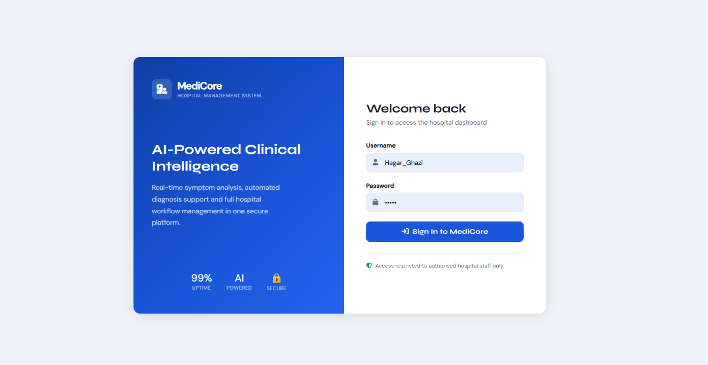
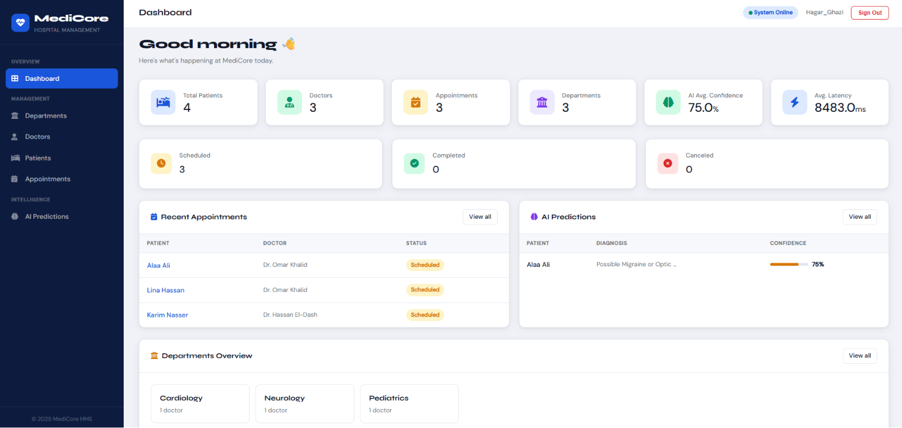
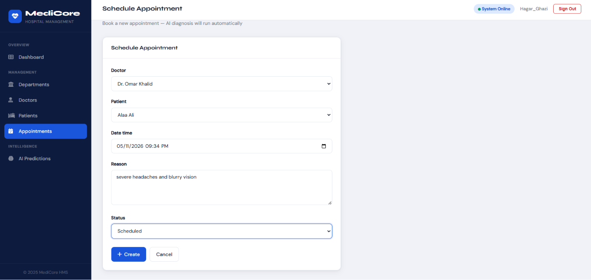
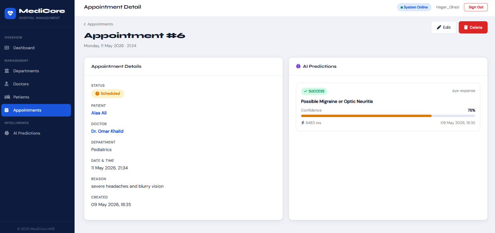
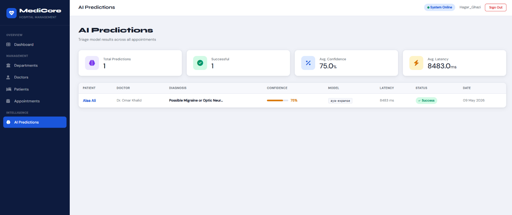
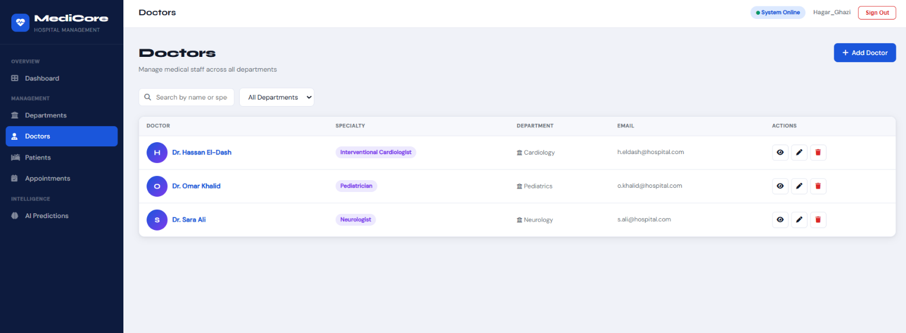
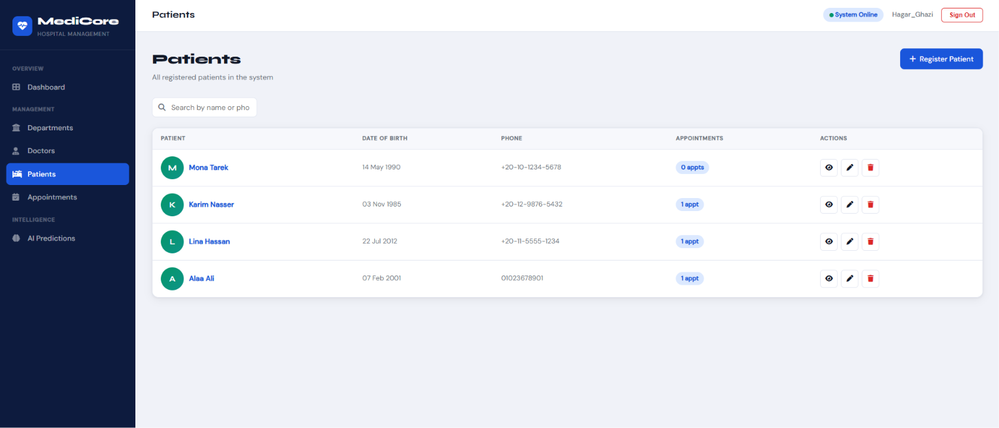

<div align="center">


# MediCore HMS
### Hospital Management System with Local AI Integration

[](https://python.org)
[](https://djangoproject.com)
[](https://ollama.ai)
[](LICENSE)

*A full-stack clinical management platform with a locally-running AI diagnostic pipeline no cloud APIs no data leakage no recurring costs*

</div>

---

## 📸 Screenshots

### Sign In


### Dashboard


### Schedule Appointment + AI Trigger


### Appointment Detail with AI Prediction


### AI Predictions Log


### Doctors


### Patients


---

## 🧭 Overview

MediCore HMS is a capstone project built as the final phase of a Django engineering curriculum
It implements a complete hospital management workflow departments, doctors, patients and appointments layered with a real-time AI diagnostic engine powered by a **locally-running Ollama model** (Aya Expanse)

The system was designed around three engineering pillars:

| Pillar | Implementation |
|---|---|
| **Security** | Environment variables via `python-dotenv`, `@login_required` on every view, CSRF protection on all forms |
| **Resilience** | Full `try/except` wrapping on all AI calls the server never crashes due to a model failure |
| **Observability** | Per-prediction telemetry: model version, token count, latency (ms), success/failure status, error messages |

---

## ✨ Features

### 🔐 Authentication & Access Control
- Django's built-in `LoginView` and `LogoutView` wired to custom-styled templates
- Every route dashboard, CRUD views, AI pipeline protected with `@login_required`
- Unauthorized users are automatically redirected to the login page
- CSRF token enforced on all POST forms including logout


### 🏢 Admin Panel (CMS)
- All five models registered: `Department`, `Doctor`, `Patient`, `Appointment`, `AIPrediction`
- `@admin.register()` decorator used on `Appointment` and `AIPrediction` as required
- `list_display` and `list_filter` configured for clean, scannable admin views
- Custom admin site branding: *"MediCore HMS — Administration"*
- Date hierarchy on appointments for quick time-based filtering


### 🤖 AI Diagnostic Pipeline
- New appointments automatically trigger the Ollama model on form submission
- `commit=False` pattern used to intercept the save and attach AI results before persisting
- Structured JSON prompt enforces a consistent response schema: `diagnosis`, `confidence`, `urgency`, `notes`
- Token count extracted from Ollama's `eval_count + prompt_eval_count` metadata
- AI result stored as a linked `AIPrediction` record with full telemetry


### 🛡 Error Handling & Telemetry
- Every AI call wrapped in `try/except Exception` — catches connection errors, timeouts, HTTP errors, and malformed JSON
- On success → `AIPrediction` saved with `status="SUCCESS"`, confidence score, latency, token count
- On failure → `AIPrediction` saved with `status="FAILED"`, `error_message` logged, tokens set to 0
- User is always redirected safely to the dashboard regardless of AI outcome
- All events logged via Python's `logging` module for server-side traceability

### 🔒 Environment Security
- API keys and configuration stored in `.env` via `python-dotenv`
- `.env` excluded from version control via `.gitignore`
- Django `SECRET_KEY`, `DEBUG`, `ALLOWED_HOSTS`, and all Ollama settings loaded from environment at runtime
- Zero hard-coded credentials anywhere in the codebase

---

## 🏗 Architecture

```
hospital_project/
│
├── config/                         # Django project configuration
│   ├── settings.py                 # Environment-aware settings via dotenv
│   └── urls.py                     # Root URLs: admin + auth + hospital app
│
├── hospital/                       # Main application
│   ├── ai_service.py               # Ollama HTTP client & OllamaResult dataclass
│   ├── admin.py                    # CMS: all models registered with list_display
│   ├── models.py                   # Department, Doctor, Patient, Appointment, AIPrediction
│   ├── views.py                    # All views protected with @login_required
│   ├── forms.py                    # ModelForms for Doctor, Patient, Appointment
│   ├── urls.py                     # App-level URL patterns
│   │
│   ├── migrations/
│   │   ├── 0001_initial.py
│   │   └── 0002_aiprediction_token_count.py   # Telemetry field migration
│   │
│   └── templates/
│       ├── hospital/               # All app templates (dashboard, lists, forms)
│       └── registration/
│           └── login.html          # Custom split-panel login page
│
├── .env                            # !! Never commit — local secrets only
├── .gitignore                      # Excludes .env, .venv, db.sqlite3, __pycache__
└── pyproject.toml                  # Dependencies: django, python-dotenv, requests
└── artifacts                       # Website Screenshots
```

---

## 🤖 AI Pipeline — Deep Dive

```
User submits appointment form (reason = patient symptoms)
              │
              ▼
      AppointmentForm.is_valid()
              │
              ▼
    appointment = form.save(commit=False)
    appointment.save()  ──► DB: Appointment persisted, PK assigned
              │
              ▼
    run_diagnosis(reason)  ◄── hospital/ai_service.py
              │
    ┌─────────┴──────────┐
    │                    │
 SUCCESS              FAILED
    │                    │
AIPrediction(        AIPrediction(
  status="SUCCESS"     status="FAILED"
  diagnosis=...        error_message=str(e)
  confidence=0.75      confidence=0.0
  token_count=312      token_count=0
  latency_ms=8483      latency_ms=...
)                    )
    │                    │
    └─────────┬──────────┘
              ▼
    redirect("dashboard")   ← user always lands safely
```

### Ollama Prompt Engineering

The AI service sends a **system prompt** that forces the model to respond in strict JSON only:

```json
{
  "diagnosis": "Possible Migraine or Optic Neuritis",
  "confidence": 0.75,
  "urgency": "HIGH",
  "notes": "Recommend ophthalmology and neurology referral. Rule out elevated ICP."
}
```

This structured output is then parsed, validated, and stored — making every prediction machine-readable and auditable.

---

## 🚀 Quick Start

### Prerequisites

- Python 3.12+
- [Ollama](https://ollama.ai) installed locally
- `aya-expanse` model (or any Ollama-compatible model)

```bash
# Pull the AI model (one-time setup)
ollama pull aya-expanse

# Verify Ollama is running
ollama serve
```

### Installation

```bash
# 1. Clone the repository
git clone https://github.com/your-username/medicore-hms.git
cd medicore-hms/hospital_project


# 2. Create and activate virtual environment
uv venv
# Windows:
.venv\Scripts\activate
# macOS/Linux:
source .venv/bin/activate


# 3. Install dependencies
uv sync
# or: pip install django python-dotenv requests
```

### Configuration

Your `.env` file at the project root should contain:

```env
DJANGO_SECRET_KEY="your-secret-key-here"
DJANGO_DEBUG=True
DJANGO_ALLOWED_HOSTS=127.0.0.1,localhost

OLLAMA_BASE_URL=http://127.0.0.1:11434
OLLAMA_MODEL=aya-expanse
OLLAMA_TIMEOUT=60
```


### Database Setup

```bash
# Apply all migrations
python manage.py migrate

# Create admin superuser
python manage.py createsuperuser

# (Optional) Load sample data
python seed.py
```

### Run

```bash
python manage.py runserver
```

Open **http://127.0.0.1:8000** — you will be redirected to the login page.

---

## 🔗 Key URLs

| URL | Description | Auth Required |
|---|---|---|
| `/` | Main dashboard | ✅ |
| `/auth/login/` | Login page | ❌ |
| `/auth/logout/` | Logout (POST) | ✅ |
| `/admin/` | Django Admin CMS | ✅ Superuser |
| `/appointments/add/` | Schedule appointment + trigger AI | ✅ |
| `/predictions/` | AI telemetry log | ✅ |
| `/departments/` | Department management | ✅ |
| `/doctors/` | Doctor management | ✅ |
| `/patients/` | Patient management | ✅ |

---

## 🧪 Testing the Pipeline

1. Start the server and log in
2. Navigate to **Appointments → Schedule Appointment**
3. Fill in doctor, patient, date and enter symptoms in the **Reason** field:
   > *"severe headaches and blurry vision"*
4. Click **Create**
5. Check the **Dashboard** → AI Predictions panel
6. Navigate to `/admin/` → **AI Predictions** to inspect the full telemetry record

---

## 📦 Dependencies

| Package | Version | Purpose |
|---|---|---|
| `django` | 6.0+ | Web framework, ORM, admin, auth |
| `python-dotenv` | 1.0+ | Environment variable loading |
| `requests` | 2.32+ | HTTP client for Ollama API calls |

---


## 🔮 Possible Extensions

- **WebSocket live updates** — push AI results to the UI without page reload
- **Multi-model routing** — route different symptom categories to specialist models
- **PDF report generation** — export appointment + AI prediction as clinical document
- **Role-based access control** — separate permissions for doctors, nurses, admins
- **Audit logging** — track every create/edit/delete action with user and timestamp

---

<div align="center">

Built with Django · Powered by Ollama · Secured with python-dotenv

*MediCore HMS Capstone Project*

</div>
